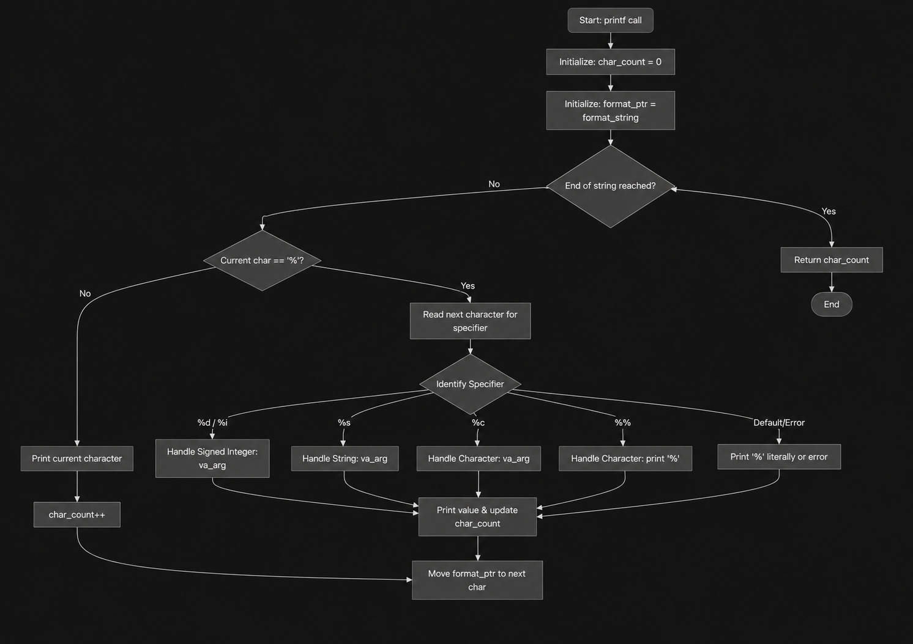

# C - printf

## Description
This project is a custom implementation of the C standard library function `printf`. The function `_printf` formats and prints data to the standard output stream (`stdout`) according to a specified format string. 

This is a collaborative project completed as part of the Software Engineering curriculum at **Holberton School / Tuwaiq Academy**.

---

## Technical Requirements & Guidelines
* **Environment:** Ubuntu 20.04 LTS
* **Compiler:** `gcc` using flags `-Wall -Werror -Wextra -pedantic -std=gnu89 -Wno-format *.c`
* **Style standard:** All C files strictly adhere to the **Betty** coding style guide (validated via `betty-style.pl` and `betty-doc.pl`).
* **Global variables:** Strictly forbidden.
* **Function limit:** No more than 5 functions per file.
* **Header file:** `main.h` contains all function prototypes and is properly protected with include guards (`#ifndef MAIN_H`).

---

## Authorized Functions & Macros
* `write` (`man 2 write`)
* `va_start` (`man 3 va_start`)
* `va_end` (`man 3 va_end`)
* `va_copy` (`man 3 va_copy`)
* `va_arg` (`man 3 va_arg`)

---

## Supported Conversion Specifiers

| Specifier | Type / Description | Example Usage | Output |
| :---: | :--- | :--- | :--- |
| **`%c`** | Single character | `_printf("%c", 'A');` | `A` |
| **`%s`** | String of characters | `_printf("%s", "Hello World");` | `Hello World` |
| **`%%`** | Percent sign | `_printf("%%");` | `%` |
| **`%d`** | Signed decimal integer | `_printf("%d", 1024);` | `1024` |
| **`%i`** | Signed integer | `_printf("%i", -762534);` | `-762534` |

---

## File Structure & Organization

| File | Description | Developed By |
| :--- | :--- | :--- |
| **`main.h`** | Header file containing all function prototypes, includes, and `struct` definitions. | Shatha Alghamdi |
| **`_printf.c`** | Main entry function that parses format string and routes specifiers. | Shatha Alghamdi |
| **`functions.c`** | Handler functions for `%c`, `%s`, and `%%` conversion specifiers. | Shatha Alghamdi |
| `man_3_printf` | Manual page for the custom `_printf` function |Shatha Alghamdi |
| **`README.md`** | Comprehensive project documentation and installation guide. | Arwa Alhomrani |

The project structure is:

```text
holbertonschool-printf/
├── _printf.c
├── functions.c
├── main.h
├── man_3_printf
├── print_numbers.c
├── README.md
└── images/
    └── printf_flowchart.png
```

---

## Flowchart

The following flowchart illustrates how the `_printf` function processes the format string and handles the supported conversion specifiers.



---

## Compilation & Usage

### 1. Clone the repository

Clone the project from GitHub to your local machine:

```bash
git clone https://github.com/ShathaAlghamdi/holbertonschool-printf.git
```

Then navigate into the project directory:

```bash
cd holbertonschool-printf
```

---

### 2. Compile the project

Compile the source files using GCC with the required flags:

```bash
gcc -Wall -Werror -Wextra -pedantic -std=gnu89 -Wno-format *.c -o printf
```

This command compiles all `.c` files in the project and creates an executable file named `printf`.

---

### 3. Run the program

After successful compilation, run the executable:

```bash
./printf
```

---

### 4. Using `_printf`

The `_printf` function can be used similarly to the standard `printf` function.

Example:

```c
#include "main.h"

int main(void)
{
    _printf("Character: %c\n", 'H');
    _printf("String: %s\n", "Hello World");
    _printf("Number: %d\n", 123);
    _printf("Integer: %i\n", -45);
    _printf("Percent: %%\n");

    return (0);
}
```

Expected output:

```text
Character: H
String: Hello World
Number: 123
Integer: -45
Percent: %
```

---

The `_printf` function returns the total number of characters printed.
